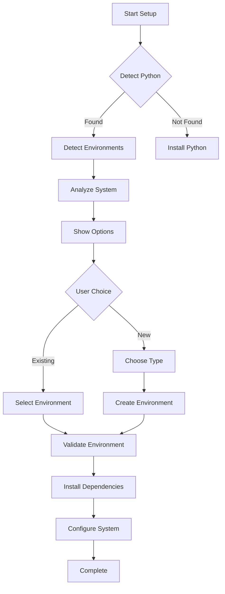

# Chatterbox TTS Modular Architecture Design Document

## Executive Summary

This document outlines the redesign of the current monolithic Chatterbox TTS batch processing system into a modular, maintainable Python package with intelligent environment detection and interactive setup capabilities.

## Current System Analysis

The existing system (`setup_chatterbox_tts.sh`) has several architectural limitations:
- **Monolithic structure**: Single large script files (>500 lines)
- **Limited environment management**: Only creates new venv, no detection
- **No package structure**: Flat directory with loose Python files
- **Poor separation of concerns**: API, processing, and utilities mixed together
- **No configuration management**: Hard-coded paths and settings

## Proposed Modular Architecture

### 1. Package Structure

```
chatterbox_tts/
├── pyproject.toml                 # Modern Python packaging
├── README.md
├── LICENSE
├── .gitignore
├── .env.example                   # Environment template
├── setup.py                       # Legacy setup support
├── requirements/
│   ├── base.txt                   # Core dependencies
│   ├── dev.txt                    # Development dependencies
│   └── cuda.txt                   # CUDA-specific dependencies
├── src/
│   └── chatterbox_tts/
│       ├── __init__.py
│       ├── __main__.py           # CLI entry point
│       ├── api/
│       │   ├── __init__.py
│       │   ├── server.py         # FastAPI server (<200 lines)
│       │   ├── routes.py         # API endpoints (<150 lines)
│       │   └── models.py         # Pydantic models (<100 lines)
│       ├── core/
│       │   ├── __init__.py
│       │   ├── processor.py      # TTS processing engine (<250 lines)
│       │   ├── models.py         # ML model management (<200 lines)
│       │   └── config.py         # Configuration management (<150 lines)
│       ├── worker/
│       │   ├── __init__.py
│       │   ├── job_queue.py      # Background job handling (<200 lines)
│       │   └── scheduler.py      # Job scheduling (<150 lines)
│       ├── utils/
│       │   ├── __init__.py
│       │   ├── logging_config.py # Logging setup (<100 lines)
│       │   ├── file_utils.py     # File operations (<100 lines)
│       │   └── validators.py     # Input validation (<100 lines)
│       └── cli/
│           ├── __init__.py
│           ├── setup.py          # Interactive setup (<300 lines)
│           └── commands.py       # CLI commands (<200 lines)
├── scripts/
│   ├── install.py                # Cross-platform installer
│   ├── detect_env.py             # Environment detection
│   └── setup_dev.sh              # Development setup
├── tests/
│   ├── __init__.py
│   ├── test_api/
│   ├── test_core/
│   └── test_worker/
├── docs/
│   ├── architecture.md
│   ├── api_reference.md
│   └── deployment.md
└── examples/
    ├── basic_usage.py
    ├── batch_processing.py
    └── custom_config.py
```

### 2. Module Responsibilities

#### Core Modules (Each <300 lines)

**`api/server.py`** - FastAPI application factory
- Server initialization and middleware setup
- CORS configuration
- Health check endpoints
- Graceful shutdown handling

**`api/routes.py`** - REST API endpoints
- Job submission (`POST /jobs`)
- Job status (`GET /jobs/{job_id}`)
- Job listing (`GET /jobs`)
- File download (`GET /jobs/{job_id}/download`)

**`api/models.py`** - Pydantic schemas
- Request/response models
- Job status enumeration
- Validation schemas

**`core/processor.py`** - TTS processing engine
- Text preprocessing
- Audio generation pipeline
- Model fallback handling
- Progress tracking

**`core/models.py`** - ML model management
- Model loading/unloading
- GPU/CPU detection
- Model caching
- Memory optimization

**`core/config.py`** - Configuration management
- Environment variable loading
- Config validation
- Default settings
- Runtime configuration updates

**`worker/job_queue.py`** - Background job processing
- Async job execution
- Status tracking
- Error handling
- Retry mechanisms

**`worker/scheduler.py`** - Job scheduling
- Priority queues
- Resource management
- Rate limiting
- Batch processing

#### Utility Modules

**`utils/logging_config.py`** - Centralized logging
- Structured logging setup
- Log rotation
- Different log levels per environment

**`utils/file_utils.py`** - File operations
- Safe file handling
- Directory management
- Cleanup utilities

**`utils/validators.py`** - Input validation
- File type validation
- Content sanitization
- Size limits

### 3. Interactive Environment Detection System

#### Environment Detection Script (`scripts/detect_env.py`)

```python
class EnvironmentDetector:
    """Detects and manages Python environments across platforms."""
    
    SUPPORTED_ENVS = {
        'venv': VirtualEnvManager,
        'conda': CondaEnvManager,
        'miniconda': MinicondaEnvManager,
        'poetry': PoetryEnvManager,
        'pipenv': PipenvEnvManager,
    }
    
    def detect_existing_environments(self) -> List[EnvironmentInfo]:
        """Scan system for existing Python environments."""
        pass
    
    def get_environment_recommendations(self) -> List[Recommendation]:
        """Provide ranked recommendations based on system state."""
        pass
    
    def create_interactive_setup(self) -> SetupResult:
        """Interactive CLI for environment selection."""
        pass
```

#### Environment Managers

Each environment type has a dedicated manager class:

**`VirtualEnvManager`** - Standard venv
- Cross-platform compatibility
- Built-in Python support
- Lightweight

**`CondaEnvManager`** - Anaconda/Miniconda
- Scientific computing focus
- Package management
- Environment cloning

**`PoetryEnvManager`** - Poetry
- Dependency resolution
- Lock file support
- Modern Python packaging

### 4. Interactive Setup Flow

#### Setup Process Flowchart



#### Interactive CLI Features

**Environment Selection Menu:**
```
┌─────────────────────────────────────────┐
│  Chatterbox TTS Environment Setup       │
├─────────────────────────────────────────┤
│ Detected Environments:                  │
│ 1) conda:base (Python 3.9)             │
│ 2) venv:tts-env (Python 3.8)           │
│ 3) poetry:chatterbox (Python 3.10)     │
│                                         │
│ Options:                                │
│ N) Create New Environment               │
│ S) Skip (use system Python)             │
│ Q) Quit                                 │
└─────────────────────────────────────────┘
```

**New Environment Creation:**
```
┌─────────────────────────────────────────┐
│ Create New Environment                  │
├─────────────────────────────────────────┤
│ Select Type:                            │
│ 1) venv (Recommended)                   │
│ 2) conda (Scientific)                   │
│ 3) poetry (Modern)                      │
│                                         │
│ Python Version: 3.8-3.11                │
│ Location: [~/chatterbox_tts/venv]      │
└─────────────────────────────────────────┘
```

### 5. Configuration Management

#### Configuration Hierarchy

1. **Environment Variables** (highest priority)
2. **Local config file** (`chatterbox.yaml`)
3. **User config** (`~/.config/chatterbox_tts/config.yaml`)
4. **Package defaults** (lowest priority)

#### Configuration Schema

```yaml
# chatterbox.yaml
api:
  host: "0.0.0.0"
  port: 2049
  workers: 1

processing:
  model: "microsoft/speecht5_tts"
  batch_size: 1
  max_text_length: 10000
  output_format: "wav"
  sample_rate: 16000

directories:
  input: "./_jobs_input_dir"
  output: "./_jobs_output_dir"
  temp: "./_temp"
  logs: "./logs"

logging:
  level: "INFO"
  format: "json"
  rotation: "daily"
  retention: "30 days"

monitoring:
  enabled: true
  metrics_port: 8001
  health_check_interval: 30
```

### 6. Installation Workflow

#### Cross-Platform Installation

**Windows:**
```powershell
# PowerShell installation
iwr -useb https://raw.githubusercontent.com/chatterbox-tts/install/main/install.ps1 | iex
```

**macOS/Linux:**
```bash
# Bash installation
curl -fsSL https://raw.githubusercontent.com/chatterbox-tts/install/main/install.sh | bash
```

**Python Package:**
```bash
# PyPI installation
pip install chatterbox-tts

# Development installation
git clone https://github.com/chatterbox-tts/chatterbox_tts.git
cd chatterbox_tts
pip install -e .
```

#### Installation Steps

1. **System Check**
   - Python version compatibility
   - Available disk space
   - Network connectivity
   - GPU availability (optional)

2. **Environment Selection**
   - Interactive environment detection
   - User preference collection
   - Compatibility validation

3. **Dependency Installation**
   - Core dependencies
   - Optional CUDA support
   - Development tools (if requested)

4. **Configuration Setup**
   - Interactive configuration wizard
   - Environment-specific defaults
   - Validation and testing

5. **Verification**
   - System health checks
   - Model loading tests
   - API endpoint testing

### 7. Development Workflow

#### Development Setup

```bash
# Clone repository
git clone https://github.com/chatterbox-tts/chatterbox_tts.git
cd chatterbox_tts

# Run interactive setup
python scripts/setup_dev.py

# Install in development mode
pip install -e ".[dev]"

# Run tests
pytest tests/

# Start development server
python -m chatterbox_tts api --reload
```

#### Testing Strategy

**Unit Tests:**
- Individual module testing
- Mock external dependencies
- Fast execution

**Integration Tests:**
- API endpoint testing
- End-to-end workflows
- Environment compatibility

**Performance Tests:**
- Model loading benchmarks
- Processing throughput
- Memory usage profiling

### 8. Deployment Options

#### Docker Deployment

```dockerfile
FROM python:3.9-slim

WORKDIR /app
COPY requirements/base.txt .
RUN pip install -r base.txt

COPY src/ ./src/
COPY chatterbox.yaml .

EXPOSE 2049
CMD ["python", "-m", "chatterbox_tts", "api"]
```

#### Systemd Service

```ini
[Unit]
Description=Chatterbox TTS API
After=network.target

[Service]
Type=exec
User=chatterbox
WorkingDirectory=/opt/chatterbox_tts
ExecStart=/opt/chatterbox_tts/venv/bin/python -m chatterbox_tts api
Restart=always
RestartSec=10

[Install]
WantedBy=multi-user.target
```

### 9. Monitoring and Observability

#### Health Checks

```python
# Built-in health check endpoint
GET /health
{
  "status": "healthy",
  "timestamp": "2024-01-19T12:00:00Z",
  "checks": {
    "model": "ok",
    "disk_space": "ok",
    "memory": "ok"
  }
}
```

#### Metrics Collection

- Processing time per job
- Queue length
- Error rates
- Resource utilization

### 10. Migration Strategy

#### From Monolithic to Modular

**Phase 1: Structure Creation**
- Create new package structure
- Move existing code into modules
- Maintain backward compatibility

**Phase 2: Environment Integration**
- Add interactive setup
- Implement environment detection
- Create migration scripts

**Phase 3: Testing & Validation**
- Comprehensive testing
- Performance benchmarks
- User acceptance testing

**Phase 4: Documentation & Release**
- Update documentation
- Create migration guides
- Release new version

## Implementation Timeline

### Week 1: Foundation
- Package structure setup
- Core module creation
- Configuration system

### Week 2: Environment System
- Environment detection
- Interactive setup CLI
- Cross-platform compatibility

### Week 3: API & Processing
- FastAPI server implementation
- TTS processing engine
- Background job system

### Week 4: Testing & Polish
- Comprehensive testing
- Documentation
- Release preparation

## Success Metrics

- **Modularity**: All modules <300 lines
- **Setup Time**: <5 minutes for new users
- **Environment Support**: 5+ environment types
- **Test Coverage**: >80%
- **Documentation**: Complete API docs + tutorials

This architecture provides a robust, maintainable foundation for the Chatterbox TTS system while addressing all current limitations and providing clear upgrade paths for users.