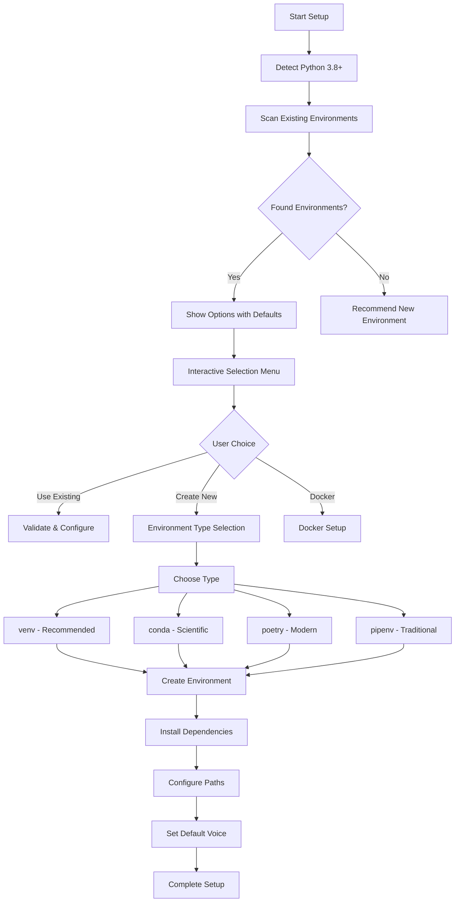

# Chatterbox TTS Enhanced Modular Architecture Design Document v2

## Key Updates Based on User Feedback

### 1. Enhanced API Features
- **Port 2049** as default API port
- **Voice management system** with default voice selection
- **Document processing pipeline** for large JSON/text files
- **Audio stitching capabilities** for multi-part processing
- **Customizable storage locations** for all file types

### 2. Improved Environment Detection
- **Default environment recommendation** based on Chatterbox best practices
- **Interactive selection** with existing vs new environment options
- **Docker support** as optional (not default)
- **Cross-platform voice file management**

### 3. Enhanced User Experience
- **One-line text processing** API endpoint
- **Bulk document processing** with automatic segmentation
- **Persistent voice settings** across sessions
- **Flexible output directory configuration**

## Updated Package Structure

```
chatterbox_tts/
├── pyproject.toml
├── README.md
├── .env.example
├── requirements/
│   ├── base.txt
│   ├── dev.txt
│   ├── cuda.txt
│   └── docker.txt
├── src/
│   └── chatterbox_tts/
│       ├── __init__.py
│       ├── __main__.py
│       ├── api/
│       │   ├── __init__.py
│       │   ├── server.py         # Port 2049 default
│       │   ├── routes.py         # Enhanced endpoints
│       │   └── models.py         # Voice & config models
│       ├── core/
│       │   ├── __init__.py
│       │   ├── processor.py      # Enhanced processing
│       │   ├── models.py         # ML model management
│       │   ├── voice_manager.py  # Voice selection & defaults
│       │   ├── document_parser.py # JSON/text processing
│       │   └── audio_stitcher.py # Multi-part audio assembly
│       ├── worker/
│       │   ├── __init__.py
│       │   ├── job_queue.py
│       │   ├── scheduler.py
│       │   └── bulk_processor.py # Large document handling
│       ├── utils/
│       │   ├── __init__.py
│       │   ├── logging_config.py
│       │   ├── file_utils.py
│       │   ├── path_manager.py   # Custom path handling
│       │   └── validators.py
│       └── cli/
│           ├── __init__.py
│           ├── setup.py          # Enhanced interactive setup
│           ├── commands.py
│           └── voice_config.py   # Voice management CLI
├── voices/                       # Default voice storage
│   ├── default/
│   ├── custom/
│   └── downloaded/
├── scripts/
│   ├── install.py
│   ├── detect_env.py            # Enhanced detection
│   ├── setup_dev.sh
│   └── docker/
│       ├── Dockerfile
│       └── docker-compose.yml
├── config/
│   ├── voices.yaml              # Voice configurations
│   └── processing.yaml          # Processing defaults
└── examples/
    ├── single_line.py
    ├── bulk_document.py
    └── custom_voice.py
```

## Enhanced API Endpoints

### Core Endpoints (Port 2049)

```python
# Single line processing
POST /api/v1/tts/single
{
    "text": "Hello world",
    "voice_id": "default",
    "output_filename": "hello.wav"
}

# Bulk document processing
POST /api/v1/tts/bulk
{
    "document": "large_text_content",
    "voice_id": "default",
    "chunk_size": 1000,
    "stitch_audio": true,
    "output_filename": "document.wav"
}

# JSON document processing
POST /api/v1/tts/json
{
    "json_data": {...},
    "text_field": "content",
    "voice_id": "default",
    "output_filename": "json_audio.wav"
}

# Voice management
GET /api/v1/voices
POST /api/v1/voices/select
PUT /api/v1/voices/default
DELETE /api/v1/voices/{voice_id}

# Configuration
GET /api/v1/config
PUT /api/v1/config
POST /api/v1/config/reset
```

## Enhanced Environment Detection System

### Interactive Setup Flow



### Environment Selection Menu

```
┌─────────────────────────────────────────────┐
│  Chatterbox TTS Environment Setup          │
├─────────────────────────────────────────────┤
│ Detected Python Environments:               │
│                                             │
│ 1) ✅ venv:chatterbox (Python 3.9) [REC]   │
│    Location: ~/venvs/chatterbox            │
│    Status: Ready                           │
│                                             │
│ 2) conda:base (Python 3.8)                 │
│    Location: ~/anaconda3                   │
│    Status: Available                       │
│                                             │
│ 3) poetry:tts-project (Python 3.10)        │
│    Location: ~/projects/tts                │
│    Status: Available                       │
│                                             │
│ ─────────────────────────────────────────── │
│                                             │
│ N) Create New Environment                  │
│ D) Use Docker (Advanced)                   │
│ S) Skip (System Python - Not Recommended)  │
│ Q) Quit                                    │
│                                             │
│ Recommended: venv (Option 1)               │
└─────────────────────────────────────────────┘
```

## Voice Management System

### Voice Configuration Schema

```yaml
# voices.yaml
voices:
  default:
    id: "microsoft_speecht5"
    name: "Microsoft SpeechT5"
    model: "microsoft/speecht5_tts"
    vocoder: "microsoft/speecht5_hifigan"
    speaker_embedding: "default"
    language: "en-US"
    gender: "neutral"
    speed: 1.0
    pitch: 1.0
    
  custom_voices:
    narrator:
      id: "custom_narrator"
      name: "Professional Narrator"
      model: "custom/path/to/model"
      speaker_embedding: "custom/path/to/embedding"
      speed: 0.9
      pitch: 1.1
      
  downloaded:
    - id: "azure_neural_en"
      name: "Azure Neural English"
      source: "azure"
    - id: "google_wavenet_en"
      name: "Google WaveNet English"
      source: "google"
```

### Voice Selection CLI

```bash
# Interactive voice setup
chatterbox setup voice

# List available voices
chatterbox voices list

# Set default voice
chatterbox voices set-default "microsoft_speecht5"

# Add custom voice
chatterbox voices add --name "My Voice" --model /path/to/model

# Test voice
chatterbox voices test "microsoft_speecht5" --text "Hello world"
```

## Document Processing Pipeline

### Large Document Handling

```python
class DocumentProcessor:
    """Handles large documents with automatic segmentation and stitching."""
    
    def process_large_text(self, text: str, config: ProcessingConfig) -> ProcessingResult:
        """Process large text documents efficiently."""
        chunks = self.segment_text(text, max_chunk_size=config.chunk_size)
        audio_chunks = []
        
        for i, chunk in enumerate(chunks):
            chunk_config = config.copy()
            chunk_config.output_filename = f"chunk_{i:03d}.wav"
            audio_chunk = self.process_chunk(chunk, chunk_config)
            audio_chunks.append(audio_chunk)
        
        if config.stitch_audio:
            return self.stitch_audio(audio_chunks, config.final_filename)
        
        return audio_chunks
    
    def process_json_document(self, json_data: dict, text_field: str, config: ProcessingConfig) -> ProcessingResult:
        """Process JSON documents with structured data."""
        texts = self.extract_text_from_json(json_data, text_field)
        return self.process_bulk_texts(texts, config)
```

### Audio Stitching Engine

```python
class AudioStitcher:
    """Stitches multiple audio files into a single cohesive output."""
    
    def stitch_audio_files(self, files: List[str], output_file: str) -> bool:
        """Combine multiple audio files with smooth transitions."""
        # Load audio segments
        segments = [self.load_audio(f) for f in files]
        
        # Apply crossfades if needed
        if self.config.crossfade_duration > 0:
            segments = self.apply_crossfades(segments)
        
        # Concatenate and save
        final_audio = np.concatenate(segments)
        self.save_audio(final_audio, output_file)
        return True
```

## Path Configuration System

### Customizable Storage Locations

```yaml
# processing.yaml
paths:
  base_directory: "~/chatterbox_tts"
  
  voices:
    default: "./voices/default"
    custom: "./voices/custom"
    downloaded: "./voices/downloaded"
    
  processing:
    input: "./input"
    output: "./output"
    temp: "./temp"
    logs: "./logs"
    
  cache:
    models: "./cache/models"
    audio: "./cache/audio"
    
  backups:
    location: "./backups"
    retention_days: 30
```

### Path Management CLI

```bash
# Configure paths interactively
chatterbox config paths

# Set custom output directory
chatterbox config set-output ~/Documents/chatterbox_output

# Set custom voice directory
chatterbox config set-voices ~/my_voices

# Show current configuration
chatterbox config show

# Reset to defaults
chatterbox config reset
```

## Enhanced API Usage Examples

### Single Line Processing

```python
import requests

# Quick single line
response = requests.post("http://localhost:2049/api/v1/tts/single", json={
    "text": "Hello, this is a test of the Chatterbox TTS system.",
    "voice_id": "microsoft_speecht5"
})

# Download the audio
with open("output.wav", "wb") as f:
    f.write(response.content)
```

### Bulk Document Processing

```python
# Large text document
with open("large_document.txt", "r") as f:
    document = f.read()

response = requests.post("http://localhost:2049/api/v1/tts/bulk", json={
    "document": document,
    "voice_id": "narrator",
    "chunk_size": 1000,
    "stitch_audio": True,
    "output_filename": "audiobook.wav"
})
```

### JSON Processing

```python
# Process structured data
json_data = {
    "title": "My Story",
    "chapters": [
        {"title": "Chapter 1", "content": "Once upon a time..."},
        {"title": "Chapter 2", "content": "The adventure continued..."}
    ]
}

response = requests.post("http://localhost:2049/api/v1/tts/json", json={
    "json_data": json_data,
    "text_field": "content",
    "voice_id": "storyteller",
    "output_filename": "story.wav"
})
```

## Docker Support (Optional)

### Docker Configuration

```dockerfile
FROM python:3.9-slim

WORKDIR /app

# Install system dependencies
RUN apt-get update && apt-get install -y \
    ffmpeg \
    && rm -rf /var/lib/apt/lists/*

# Copy requirements
COPY requirements/base.txt requirements/docker.txt ./
RUN pip install -r base.txt -r docker.txt

# Copy application
COPY src/ ./src/
COPY config/ ./config/

# Create directories
RUN mkdir -p /app/voices /app/input /app/output /app/logs

# Set environment variables
ENV CHATTERBOX_PORT=2049
ENV CHATTERBOX_HOST=0.0.0.0

EXPOSE 2049

CMD ["python", "-m", "chatterbox_tts", "api", "--host", "0.0.0.0", "--port", "2049"]
```

### Docker Compose

```yaml
version: '3.8'
services:
  chatterbox:
    build: .
    ports:
      - "2049:2049"
    volumes:
      - ./voices:/app/voices
      - ./input:/app/input
      - ./output:/app/output
      - ./logs:/app/logs
    environment:
      - CHATTERBOX_ENV=production
      - CHATTERBOX_LOG_LEVEL=INFO
```

## Migration from Current System

### Migration Script

```bash
#!/bin/bash
# migrate_from_monolithic.sh

echo "Migrating from monolithic to modular system..."

# Backup existing setup
cp -r chatterbox_batch_processor/ chatterbox_backup_$(date +%Y%m%d_%H%M%S)/

# Install new system
pip install chatterbox-tts

# Run migration
chatterbox migrate --from-directory chatterbox_batch_processor/

# Import existing jobs
chatterbox jobs import --input-dir _jobs_input_dir --output-dir _jobs_output_dir

echo "Migration complete! Run 'chatterbox api --port 2049' to start"
```

## Quick Start Commands

### One-Line Setup
```bash
# Install and setup in one command
curl -fsSL https://install.chatterbox-tts.dev | bash

# Or with custom options
curl -fsSL https://install.chatterbox-tts.dev | bash -s -- --port 2049 --voice microsoft_speecht5 --output ~/tts_output
```

### Basic Usage
```bash
# Start API server
chatterbox api --port 2049

# Process single line
chatterbox process "Hello world" --voice default --output hello.wav

# Process file
chatterbox process-file large_document.txt --voice narrator --output audiobook.wav

# Configure voice
chatterbox voices set-default "microsoft_speecht5"
```

This enhanced architecture provides a complete, user-friendly TTS system with advanced features for both casual users and power users, while maintaining the modular design principles.